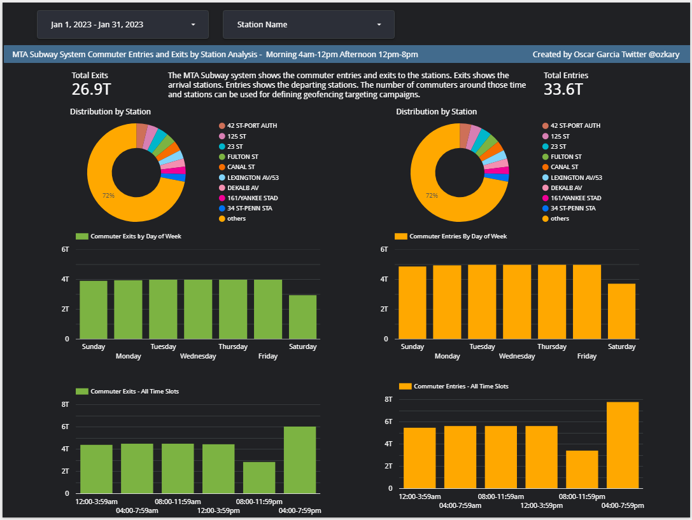
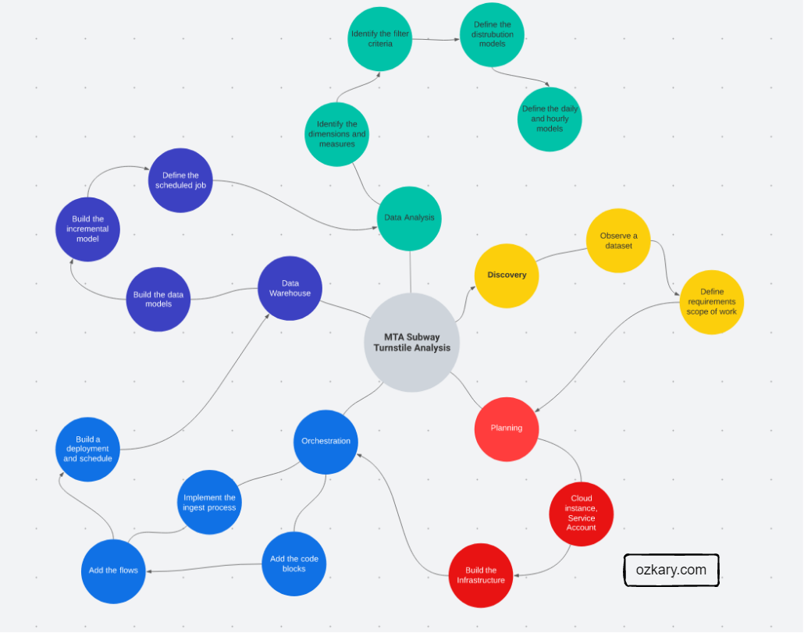

# Data Engineering - Metropolitan Transportation Authority (MTA) Subway Turnstile Data Analysis

## Problem Statement

In the city of New York, must commuter use the Metropolitan Transportation Authority (MTA) subway system for transportation. There are millions of people that use this system; therefore, businesses around the subway stations would like to be able to use Geofencing advertisement to target those commuter or possible consumers and attract them to their business locations at peak hours of the day.

Geofencing is a location based technology service in which mobile devices’ electronic signal is tracked as it enters or leaves a virtual boundary (geo-fence) on a geographical location, Businesses around those locations would like to use this technology to increase their sales.

The MTA subway system has stations around the city. All the stations are equipped with turnstiles or gates which tracks as each person enters or leaves the   station. MTA prov- ides this information in CSV files, which can be imported into a data warehouse to enable the analytical process and - identify patterns that can enable these businesses to make smart decisions on how to target consumers.

## Analytical Approach

### Dataset Criteria

We are using the MTA Turnstile data for 2023. Using that data, we can investigate the following criteria:

- Stations with the high number of exits by day and hours
- Stations with high number of entries by day and hours

Exits indicates that commuters are arriving to those locations. Entries indicate that commuters are departing from those locations.

### Data Analysis Criteria

The data can be grouped into stations, date and time of the day. This data is audited in blocks of fours hours apart. This means that there are intervals of 8am to 12pm as an example. We analyze the data into those time block interval to help us understand the best time windows both in the morning and afternoon and station location. This should allow businesses to target a particular geo-fence that is close to their business.

## Analysis Results

https://lookerstudio.google.com/reporting/94749e6b-2a1f-4b41-aff6-35c6c33f401e

### Data Analysis Conclusions

By looking at the dashboard, the following conclusions can be observed:

  - The stations with the highest distribution represent the busiest location 
  - The busiest time slot for both exits and entries is the hours between 4pm to 9pm
  - All days of the week show a high volume of commuters

With these observations, plans can be made to optimize the marketing campaigns and target users around a geo-fence area and hours of the day with proximity to the corresponding business locations.  

## Data Engineering Process
This project was executed following this process. The details for each of these process steps can be found on the project subdirectories.

- [Discovery](Step1-Discovery/)
  - Data analysis
  - Define Scope of work
- [Planning](Step2-Cloud-Infrastructure/)
  - Provision accounts
  - Build Infrastructure
- [Orchestration Implementation](Step3-Orchestration)
  - Code blocks for authorization of the code
  - Data ingestion workflows
  - Deployment and schedules
- [Data Warehouse and Modeling](Step4-Data-Warehouse/)
  - Use the data lake as source
  - Build the data models
  - Build the Incremental models for continuous data ingestion
  - Scheduled tasks
- [Data Analysis and Visualization](Step5-Analysis/)
    - Identify the relevant dimensions and measures to report on
    - Identify the filters 
    - Identify the visualizations for distributions and aggregated daily statistics

## Technologies

The following technologies have been used for this project:

- GitHub and Git
- Docker and Docker Hub
- Terraform
- Visual Studio Code
- Python language
- SQL
- Jupyter Notes
- Google Cloud
  - VM, Storage, BigQuery
- Prefect Cloud  (Workflow automation)
- dbt Cloud (Data modeling)

## Architecture

ADD-DIAGRAM

