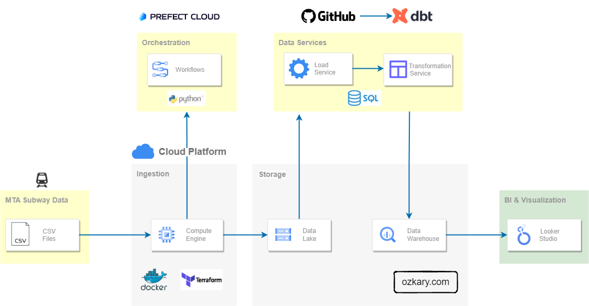

# Introduction to Data Engineering Process Fundamentals 

Welcome to the Data Engineering MTA Turnstile project! This repository leverages real-world MTA Turnstile data, offering a comprehensive guide to data engineering concepts through hands-on experience.

## What's Inside?

- Extensive Book: Data Engineering Process Fundamentals. Dive deep into the core concepts of data engineering with this detailed guide.
- YouTube Videos: Follow along with detailed video tutorials that explain each step and concept in detail.
- Comprehensive Codebase: Our codebase features:

  - Python: Core scripts and data processing.
  - Jupyter Notebooks: Interactive data exploration and visualization.
  - SQL: Database queries and transformations.
  - Looker Studio: Advanced analytics and reporting.
  - Cloud Data Lake: Efficient and scalable data storage.
  - Data Warehouse: Structured data management.
  - Other Cloud Technologies: Utilize various cloud-based tools to implement your solution step-by-step.
  
## Why Use This Repository?
  
- Real-World Application: Based on actual MTA Turnstile data, providing a practical learning experience.
- Process-Oriented Approach: Implement data engineering using a systematic, process-oriented approach for better clarity and efficiency.
- Step-by-Step Implementation: Follow along with the book and videos to implement each component of the solution.
- Free and Accessible: Leverage cloud technologies that are freely available, ensuring you can recreate and extend the project without barriers.
   

<a target="_ozkary" style="font-size:1.5rem;margin-right:20px;" href="https://www.ozkary.com">
Written by Oscar Garcia
</a>

  

<a target="_ozkary" style="font-size:1.5rem" href="https://twitter.com/ozkary">
Twitter @ozkary
</a> 

 

<a target="_wiki" style="font-size:1.2rem" href="https://github.com/ozkary/data-engineering-mta-turnstile/wiki">
Use this project Wiki for installation and configuration information
</a>

### Announcement and Updates

> 👉 Join this list to receive updates on new content about Data Engineering  [Sign up here](https://maven.com/forms/56ae79)  
> 👉 Follow us on [Twitter](https://twitter.com/ozkary "Follow Oscar D. Garcia, ozkary on Twitter")  
> 👉 [Data Engineering Process Fundamental Blog Series](https://www.ozkary.com/2023/03/data-engineering-process-fundamentals.html "Data Engineering Process Fundamental Series by Oscar D. Garcia, ozkary")    
> 👉 [Data Engineering Process Fundamental YouTube Video Podcast](https://www.youtube.com/live/14eRohtAE-w?si=8xLECzhfOhBgBB9K "Data Engineering Process Fundamental YouTube Video by Oscar D. Garcia, ozkary")    
> 👉 [Data Engineering Process Fundamental Book on Amazon](https://www.amazon.com/Data-Engineering-Process-Fundamentals-Hands/dp/B0CV7TPSNB "Data Engineering Process Fundamental Book on Amazon by Oscar D. Garcia, ozkary")    

<h5>Data Engineering Process Fundamentals: Master the Fundamentals of Data Engineering with a Hands-on Approach</h5>

## ⭐️ Star Data Engineering MTA Turnstile on GitHub!

If you find this project useful, please consider giving it a ⭐️ on GitHub! Your support helps us grow and reach more developers.

**Why Star This Project?**
- Stay updated with the latest features and improvements.
- Show your support for open-source development.
- Help others discover a valuable resource for data engineering.

## How to Star This Project
1. Visit the [Data Engineering MTA Turnstile GitHub Repository](https://github.com/ozkary/data-engineering-mta-turnstile).
2. Click on the "Star" button in the top-right corner.

Thank you for your support! 🌟

## Problem Statement

In the city of New York, commuters use the Metropolitan Transportation Authority (MTA) subway system for transportation. There are millions of people that use this system every day; therefore, businesses around the subway stations would like to be able to use Geofencing advertisement to target those commuters or possible consumers and attract them to their business locations at peak hours of the day.

Geofencing is a location based technology service in which mobile devices’ electronic signal is tracked as it enters or leaves a virtual boundary (geo-fence) on a geographical location. Businesses around those locations would like to use this technology to increase their sales.

The MTA subway system has stations around the city. All the stations are equipped with turnstiles or gates which tracks as each person enters or leaves the station. MTA provides this information in CSV files, which can be imported into a data warehouse to enable the analytical process to identify patterns that can enable these businesses to understand how to best target consumers.

## Analytical Approach

### Dataset Criteria

We are using the MTA Turnstile data for 2023. Using this data, we can investigate the following criteria:

- Stations with the high number of exits by day and hours
- Stations with high number of entries by day and hours

Exits indicates that commuters are arriving to those locations. Entries indicate that commuters are departing from those locations.

### Data Analysis Criteria

The data can be grouped into stations, date and time of the day. This data is audited in blocks of fours hours apart. This means that there are intervals of 8am to 12pm as an example. We analyze the data into those time block intervals to help us identify the best times both in the morning and afternoon for each station location. This should allow businesses to target a particular geo-fence that is close to their business.

## Analysis Results

https://lookerstudio.google.com/reporting/94749e6b-2a1f-4b41-aff6-35c6c33f401e

### Data Analysis Conclusions

By looking at the dashboard, the following conclusions can be observed:

  - The stations with the highest distribution represent the busiest location 
  - The busiest time slot for both exits and entries is the hours between 4pm to 9pm
  - All days of the week show a high volume of commuters

With these observations, plans can be made to optimize the marketing campaigns and target users around a geo-fence area and hours of the day with proximity to the corresponding business locations.  

## Architecture

## Data Engineering Process
This project was executed following this process. The details for each of these steps can be found in this project subdirectories.

**Note: Follow each link for more details**

- [Discovery](Step1-Discovery/)
  - Data analysis
  - Define Scope of work
- [Design and Infrastructure Planning](Step2-Cloud-Infrastructure/)
  - Provision accounts
  - Build Infrastructure
- [Orchestration Implementation](Step3-Orchestration)
  - Code blocks for authorization of the code
  - Data ingestion workflows
  - Deployment and schedules
- [Data Warehouse and Modeling](Step4-Data-Warehouse/)
  - Use the data lake as source
  - Build the data models
  - Build the Incremental models for continuous data ingestion
  - Scheduled tasks
- [Data Analysis and Visualization](Step5-Analysis/)
    - Identify the relevant dimensions and measures to report on
    - Identify the filters 
    - Identify the visualizations for distributions and aggregated daily statistics

## Brain Storming Process Diagram

## Technologies

The following technologies have been used for this project:

- GitHub and Git
- Docker and Docker Hub
- Terraform
- Visual Studio Code
- Python language
- SQL
- Jupyter Notes
- Google Cloud
  - VM, Storage, BigQuery
- Prefect Cloud  (Workflow automation)
- dbt Cloud (Data modeling)

