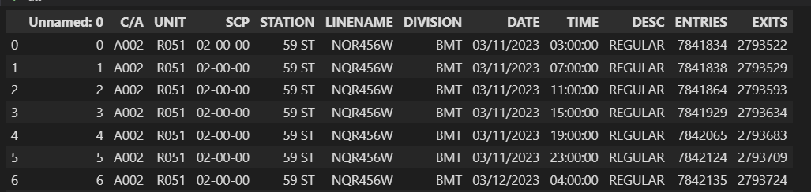
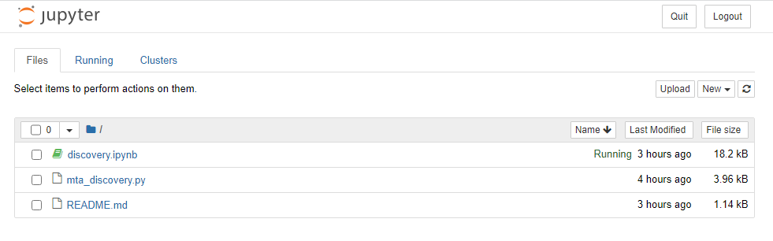
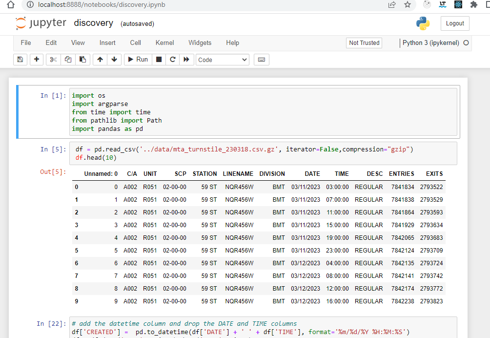
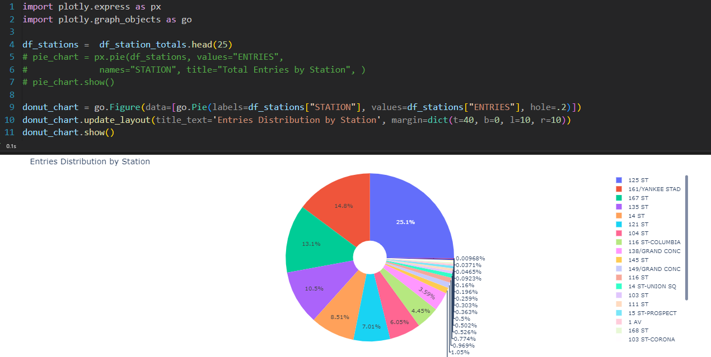

# Step 1 Discovery

 In the discovery process, we take a look at the data that is available for our analysis. We are using the MTA turnstiles information which is available at this location:

http://web.mta.info/developers/turnstile.html

We can download a single file to take a look at the data structure and make the following observations about the data:

## Observations

- It is available in weekly batches every Sunday
- The information is audited in blocks of fours hours apart
- The date and time field are on different columns
- The cumulative entries are on the ENTRIES field
- The cumulative exits are on the EXITS field
- This data is audited in blocks of fours hours apart



### Field Description

| Name | Description |
| --- | --- |
C/A      | Control Area (A002) (Booth)
UNIT     | Remote Unit for a station (R051)
SCP      | Subunit Channel Position represents an specific address for a device (02-00-00)
STATION  | Represents the station name the device is located at
LINENAME | Represents all train lines that can be boarded at this station. Normally lines are represented by one character.  LINENAME 456NQR repersents train server for 4, 5, 6, N, Q, and R trains.
DIVISION | Represents the Line originally the station belonged to BMT, IRT, or IND   
DATE     | Represents the date (MM-DD-YY)
TIME     | Represents the time (hh:mm:ss) for a scheduled audit event
DESc     | Represent the "REGULAR" scheduled audit event (Normally occurs every 4 hours). Audits may occur more that 4 hours due to planning, or troubleshooting activities. Additionally, there may be a "RECOVR AUD" entry: This refers to missed audit that was recovered. 
ENTRIES  | The cumulative entry register value for a device
EXIST    | The cumulative exit register value for a device

### Data Example

The data below shows the entry/exit register values for one turnstile at control area (A002) from 09/27/14 at 00:00 hours to 09/29/14 at 00:00 hours


|C/A|UNIT|SCP|STATION|LINENAME|DIVISION|DATE|TIME|DESC|ENTRIES|EXITS|
| --- | --- | --- | --- | --- | --- | --- | --- | --- | --- | --- |
A002|R051|02-00-00|LEXINGTON AVE|456NQR|BMT|09-27-14|00:00:00|REGULAR|0004800073|0001629137|
A002|R051|02-00-00|LEXINGTON AVE|456NQR|BMT|09-27-14|04:00:00|REGULAR|0004800125|0001629149|
A002|R051|02-00-00|LEXINGTON AVE|456NQR|BMT|09-27-14|08:00:00|REGULAR|0004800146|0001629162|


## Conclusions

Based on observations, the following conclusions can be made:

- Merge the DATE and TIME columns and create a date time column, CREATED
- The STATION column is a location dimension
- The CREATED column is the datetime dimension to enable the morning and afternoon timeframes
- The ENTRIES column  is the measure for entries
- The EXITS column is the measure for exits
- A gate can be identified by using the C/A, SCP and UNIT columns

### Requirements

These observations can be used to define technical requirements that can enable us to deliver a successful project.

- Define the infrastructure requirements to host the technology
  - Automate the provisioning of the resources using Terraform
  - Deploy the technology on a cloud platform
- Define the data orchestration process
  - On the original pipeline, load the initial data for 2023
  - Create a data pipeline that runs every week after a new file has been published
  - Copy the unstructured CSV files into a Data Lake
- Define a well-structured and optimized model on a Data Warehouse
  - Keep the source code for the models under source control
  - Copy the data into the Data Warehouse
  - Allow access to the Data Warehouse, so visualization tools can consume the data.
- Create Data Analysis dashboard with the following information  
  - Data Analysis dashboard
  - Identify the time slots for morning and afternoon analysis
  - Look at the distribution by stations
  - Look at the daily models
  - Look at the time slot models


## How to Run it!

### Requirements

<a target="_python" href="https://github.com/ozkary/data-engineering-mta-turnstile/wiki/Configure-Python-Dependencies">
Install Python, Pandas and Jupyter notebook
</a>


### Follow these steps to run the analysis

- Download a file to look at the data
  - This should create a gz file under the ../data folder

```
$ python3 mta_discovery.py --url http://web.mta.info/developers/data/nyct/turnstile/turnstile_230318.txt
```
Run the Jupyter notebook (dicovery.ipynb) to do some analysis on the data. 

- Load the Jupyter notebook to do analysis
  - First start the Jupyter server
  
```
$ jupyter notebook
```
  - See the URL on the console and click it to load on the browser
    - Click the discovery.ipynb file
      - Or open the file with VSCode and enter the URL when prompted from a kernel url







> [Design and Planning](https://github.com/ozkary/data-engineering-mta-turnstile/tree/main/Step2-Cloud-Infrastructure)