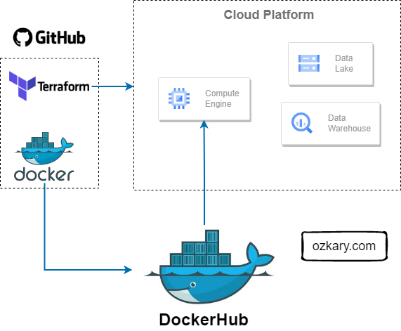
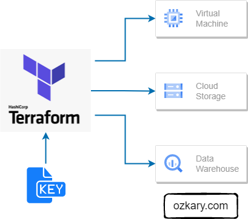
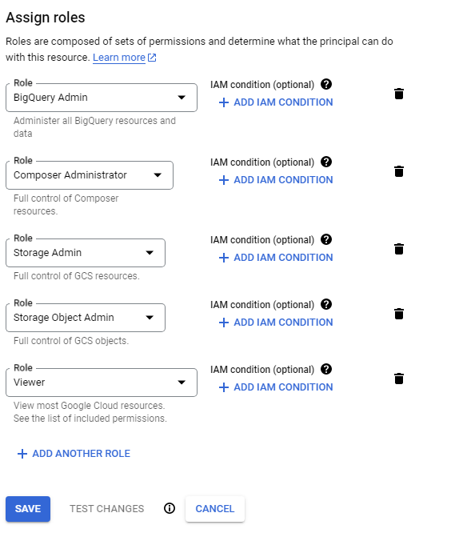
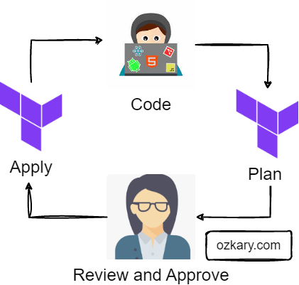

# Data Engineering Design

A data engineering design is the actual plan to build the technical solution. It includes the system architecture, data integration, flow and pipeline orchestration, the data storage platform, transformation and management, data processing and analytics tooling. This is the area where we need to clearly define the different technologies that should be used for each area. 

> 👉 [Data Engineering Fundamental Series - Design and Planning](https://www.ozkary.com/2023/04/data-engineering-process-fundamentals-design-planning.html)    
> 👉 [Data Engineering Fundamental YouTube Video](https://www.youtube.com/live/14eRohtAE-w?si=8xLECzhfOhBgBB9K)    

#### System Architecture

The system architecture is a high-level design of the solution, its components and how they integrate with each other. This often includes the data sources, data ingestion resources, workflow and data orchestration resources and frameworks, storage resources, data services for data transformation and continuous data ingestion and validation, and data analysis and visualization tooling.

#### Data Pipelines 

A data pipeline refers to a series of connected tasks that handles the extract, transform and load (ETL) as well as the extract, load and transform (ELT)  operations and integration from a source to a target storage like a data lake or data warehouse. 

The use of ETL or ELT depends on the design. For some solutions, a flow task may transform the data prior to loading it into storage. This approach tends to increase the amount of python code and hardware resources used by the hosting environment. For the ELT process, the transformation may be done using SQL code and the data warehouse resources, which often tend to perform great for big data scenarios.

#### Data Orchestration

Data orchestration refers to the automation, management and coordination of the data pipeline tasks. It involves the scheduling, workflows, monitoring and recovery of those tasks. The orchestration ensures the execution of those tasks, and it takes care of error handling, retry and the alerting of problems in the pipeline.

### Source Control and Deployment

It is important to properly define the tooling that should be used for source control and deployments automation. The area of source code should include the Python code, Terraform, Docker configuration as well as any deployment automation scripts.

#### Source Control

Client side source control systems such as Git help in tracking and maintaining the source code for our projects. Cloud side systems such as GitHub should be used to enable the team to push their code and configuration changes to a remote repository, so it can be shared with other team members.

#### Continuous Integration and Continuous Delivery (CI/CD)

 A remote code repository like GitHub also provides deployment automation pipelines that enable us to push changes to other environments for testing and finally production releases.  

Continuous Integration (CI) is the practice to continuously integrate the code changes into the central repository, so it can be built and tested to validate the latest change and provide feedback in case of problems. Continuous Deployment (CD) is the practice to automate the deployment of the latest code builds to other environments like staging and production.

#### Docker Containers and Docker Hub

When deploying a new build, we need to also deploy the environment dependencies to avoid any run-time errors. Docker containers enable us to automate the management of the application by creating a self-contained environment with the build and its dependencies. A data pipeline can be built and imported into a container image, which should contain everything needed for the pipeline to reliably execute.

Docker Hub is a container registry which allows us to push our pipeline images into a cloud repository. The goal is to provide the ability to download those images from the repository as part of the new environment provisioning process.

### Terraform for Cloud Infrastructure

Terraform is an Infrastructure as Code (IaC) tool that enables us to manage cloud resources across multiple cloud providers. By creating resource definition scripts and tracking them under version control, we can automate the creation, modification and deletion of resources. Terraform tracks the state of the infrastructure, so when changes are made, they can be applied to the environments as part of a CI/CD process. 



# Cloud Infrastructure Planning

A very important step in any technical project is to do some infrastructure planning. This is basically defining the technologies to use to successfully deliver our project. Since this is a Data Engineering project, we basically need the following resources:

- VM instance
    - To host our data pipelines and orchestration
- Data Lake 
    - To store the CSV or Parquet files
- Data Warehouse
  - To host the data to make it available to the visualization tools
      
We are building a cross-cloud platform solution, so we stick with technologies that are available in all cloud platforms. In addition, we can use Terraform to build the resources. Terraform is an open-source tool that enables us to manage infrastructure. It works with all cloud platforms. This tool enables us to create Continuous Integration Continuous Deployment (CICD) processes to manage our resources.



# Infrastructure Implementation Requirements

When using Terraform with a any cloud provider, there are several key artifacts and considerations to keep in mind for successful configuration and security. Terraform needs access to the cloud account where it can provision the resources. The account token or credentials can vary based on your cloud configuration.  For our purpose, we will use a GCP (Google) project to build our resources, but first we need to install the Terraform dependencies for the development environment.

## Install Terraform

To install Terraform, open a bash terminal and run the commands below:

- Download the package file
- Unzip the file
- Copy the Terraform binary from the extracted file to the /usr/bin/ directory
- Verify the version

```bash
$ wget https://releases.hashicorp.com/terraform/1.3.7/terraform_1.3.7_linux_amd64.zip
$ unzip terraform_1.1.2_linux_amd64.zip
$ cp terraform /usr/bin/
$ terraform -v
```

We should get an output similar to this:

```bash
Terraform v1.3.7
on linux_amd64
```
## Configure a Cloud Account

### Create a Google account. [Here](https://cloud.google.com/)
  - Create a new project
  - Make sure to keep track of the Project ID and the location for your project

###  Create a service account
 - In the left-hand menu, click on "IAM & Admin" and then select "Service accounts"
 - Click on the "Create Service Account" button at the top of the page
 - Enter a name for the service account and an optional description
 - Then add the BigQuery Admin, Storage Admin, Storage Object Admin as roles for our service account and click the save button.



 - Enable IAM APIs by clicking the following links:
   - [IAM-API](https://console.cloud.google.com/apis/library/iam.googleapis.com)
   - [IAM-credential-API](https://console.cloud.google.com/apis/library/iamcredentials.googleapis.com)

### Authenticate the VM or Local environment with GCP

- In the left navigation menu (GCP), click on "IAM & Admin" and then "Service accounts"
- Click on the three verticals dots under the action section for the service name you just created
- Then click Manage keys, Add key, Create new key. Select JSON option and click Create
- Move the key file to a system folder

```bash
$ mkdir -p $HOME/.gcp/ 
$ mv ~/Downloads/{xxxxxx}.json ~/.gcp/{acc_credentials}.json
```
- install the SDK and CLI Tools
  - <a href="https://cloud.google.com/sdk/docs/install-sdk" target="_new">Follow the instruction here</a>
- Validate the installation and login to GCP with the following commands
```
$ echo 'export GOOGLE_APPLICATION_CREDENTIALS="~/.gcp/{acc_credentials}.json"' >> ~/.bashrc
$ export GOOGLE_APPLICATION_CREDENTIALS="~/.gcp/{acc_credentials}.json"
$ gcloud auth application-default login
```
- Follow the login process on the browser

# Review the Code

## Terraform Files

Terraform uses declarative configuration files written in a domain-specific language (DSL) called HCL (HashiCorp Configuration Language). It provides a concise and human-readable syntax for defining resources, dependencies, and configurations.

At a minimum, we should define a variables file, which contains the cloud provider information and a resource file which define what kind of resources should be provision on the cloud. There could be a file for each resource or a single file can define multiple resources.  

### Variables File

The variables file is used to define a set of variables that can be used on the resource file. This allows for the use of those variables in one more more resource configuration files. The format looks as follows:

```python
locals {
  data_lake_bucket = "mta_data_lake"
}

variable "project" {
  description = "Enter Your GCP Project ID"
  type = string
}

variable "region" {
  description = "Region for GCP resources. Choose as per your location: https://cloud.google.com/about/locations"
  default = "us-east1"
  type = string
}

variable "storage_class" {
  description = "Storage class type for your bucket. Check official docs for more info."
  default = "STANDARD"
  type = string
}

variable "stg_dataset" {
  description = "BigQuery Dataset that raw data (from GCS) will be written to"
  type = string
  default = "mta_data"
}

variable "vm_image" {
  description = "Base image for your Virtual Machine."
  type = string
  default = "ubuntu-os-cloud/ubuntu-2004-lts"
}

```
### Resource File

The resource file is where we define what should be provisioned on the cloud. This is also the file where we need to define the provider specific resources that need to be created.

```python
terraform {
  required_version = ">= 1.0"
  backend "local" {}  # Can change from "local" to "gcs" (for google) or "s3" (for aws), if you would like to preserve your tf-state online
  required_providers {
    google = {
      source  = "hashicorp/google"
    }
  }
}

provider "google" {
  project = var.project
  region = var.region
  // credentials = file(var.credentials)  # Use this if you do not want to set env-var GOOGLE_APPLICATION_CREDENTIALS
}

# Data Lake Bucket
# Ref: https://registry.terraform.io/providers/hashicorp/google/latest/docs/resources/storage_bucket
resource "google_storage_bucket" "data-lake-bucket" {
  name          = "${local.data_lake_bucket}_${var.project}" # Concatenating DL bucket & Project name for unique naming
  location      = var.region

  # Optional, but recommended settings:
  storage_class = var.storage_class
  uniform_bucket_level_access = true

  versioning {
    enabled     = true
  }

  lifecycle_rule {
    action {
      type = "Delete"
    }
    condition {
      age = 15  // days
    }
  }

  force_destroy = true
}

# BigQuery data warehouse
# Ref: https://registry.terraform.io/providers/hashicorp/google/latest/docs/resources/bigquery_dataset
resource "google_bigquery_dataset" "stg_dataset" {
  dataset_id = var.stg_dataset
  project    = var.project
  location   = var.region
}

# VM instance
resource "google_compute_instance" "vm_instance" {
  name          = "mta-instance"
  project       = var.project
  machine_type  = "e2-standard-4"
  zone          = var.region

  boot_disk {
    initialize_params {
      image = var.vm_image
    }
  }

  network_interface {
    network = "default"

    access_config {
      // Ephemeral public IP
    }
  }
}
```

## Docker Example

This is a simple example of a Dockerfile. It uses a based image from Docker Hub as a starting point. 

```bash

# pull an image with prefect and python
FROM prefecthq/prefect:2.7.7-python3.9

# copy the dependency file
COPY docker-requirements.txt .

# install dependencies
RUN pip install -r docker-requirements.txt --trusted-host pypi.python.org --no-cache-dir

# build the folders in the container
RUN mkdir -p /opt/prefect/data/
RUN mkdir -p /opt/prefect/flows/

# copy source code into the container
COPY flows opt/prefect/flows

# copy any seeding data
# COPY data opt/prefect/data

```

### Dockerfile Summary

- Uses **prefect:2.7.7-python3.9** image as base.
- Installs extra dependencies from **docker-requirements.txt**.
- Creates directories for Prefect data and flows.
- Copies **flows** directory containing Prefect code.
- (Optional) Copies **data** directory for flow input.

Essentially, it sets up a container ready to run your Prefect workflows.


## How to Run it!

**Note: for this execution plan, we are using a GCP cloud project.**

### Requirements

<a target="_gcp" href="https://github.com/ozkary/data-engineering-mta-turnstile/wiki/Google-Cloud-Configuration-Notes">GCP Configuration Notes</a>

- Setup your GCP cloud project 
  - Cloud Provider account: https://console.cloud.google.com/
  - Create the service account with permissions   
  - Install the GCP SDK

<a target="_terraform" href="https://github.com/ozkary/data-engineering-mta-turnstile/wiki/Terraform-Configuration">Terraform Configuration Notes</a>

- Install Terraform
  - https://www.terraform.io/downloads


### Execution

- Refresh service-account's auth-token for this session
```bash
$ gcloud auth application-default login

```

- Set the credentials file on the bash configuration file
  - Add the export line and replace filename-here with your file

```bash
$ echo export GOOGLE_APPLICATION_CREDENTIALS="${HOME}/.gcp/filename-here.json" >> ~/.bashrc && source ~/.bashrc
```

- Open the terraform folder in your project

> [Azure Data Lake Configuration](https://github.com/ozkary/data-engineering-mta-turnstile/wiki/Terraform-Create-an-Azure-Data-Lake)

- Initialize state file (.tfstate) by running terraform init
```bash
$ cd ./terraform
$ terraform init
```
-  Check changes to new infrastructure plan

> Get the project id from your GCP cloud console

```bash  
$ terraform plan -var="project=<your-gcp-project-id>"
```

- Apply the changes

```bash
$ terraform apply -var="project=<your-gcp-project-id>"
```

- (Optional) Delete infrastructure after your work, to avoid costs on any running services

```bash
$ terraform destroy
```

#### Terraform Lifecyle





### GitHub Action

In order to be able to automate the building of infrastructure with GitHub, we need to define the cloud provider token as a secret with GitHub. This can be done by following the steps from this link:

> [Configure GitHub Secrets](https://github.com/ozkary/data-engineering-mta-turnstile/wiki/GitHub-Configure-Secrets-for-Build-Actions)


Once the secret has been configured, we can create a build action script with the cloud provider secret information as shown with this GitHub Action workflow YAML file:

```yml

name: Terraform Deployment

on:
  push:
    branches:
      - main

jobs:
  deploy:
    runs-on: ubuntu-latest
    
    steps:
    - name: Checkout repository
      uses: actions/checkout@v2
    
    - name: Set up Terraform
      uses: hashicorp/setup-terraform@v1
    
    - name: Terraform Init
       env:        
        GOOGLE_APPLICATION_CREDENTIALS:  ${{ secrets.GOOGLE_APPLICATION_CREDENTIALS }}
      run: |
        cd Step2-Cloud-Infrastructure/terraform
        terraform init
    
    - name: Terraform Apply
      run: |
        cd path/to/terraform/project
        terraform apply -auto-approve
```

This code defines a GitHub Actions workflow named "Terraform Deployment" that automatically deploys infrastructure using Terraform when changes are pushed to the "main" branch.

- Triggers on a push to the "main" branch.
- Checks out the repository code.
- Sets up Terraform environment.
- Initializes Terraform in the "Step2-Cloud-Infrastructure/terraform" directory.
- Applies Terraform changes (with auto-approval) from the "path/to/terraform/project" directory.

**Key points:**

- Uses Google Cloud credentials stored as secrets.
- Assumes specific directory structure for Terraform configurations.
- Approves Terraform changes automatically (**always requires security review**).


> 👉 [Data Pipeline and Orchestration](https://github.com/ozkary/data-engineering-mta-turnstile/tree/main/Step3-Orchestration)