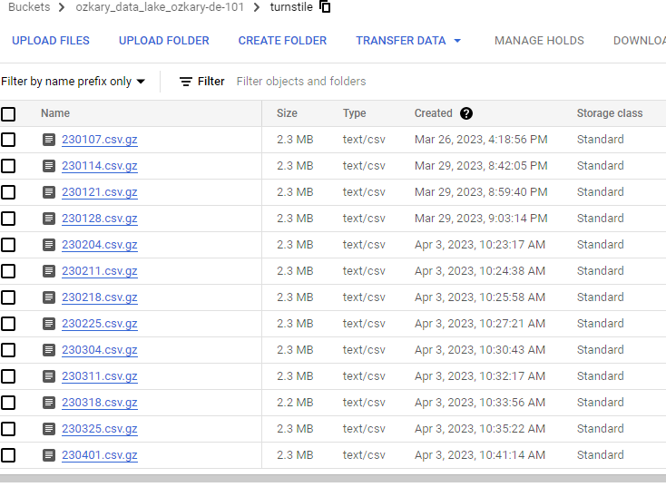

# Step 3 Data Orchestration

At this point of the project, we understand the source and structure of the data. We also have provisioned a Data Lake (DL) to store all the files that we need to download. We are ready to orchestrate a data pipeline that can enable us to process multiple files and save them to the DL using a parquet data format. Let’s first review some of these concepts.

A data pipeline is a workflow with different steps in which some data is extracted, processed and stored at another location. The automation, scheduling and monitor of these steps is referred to as orchestration. For this project, we are using Prefect cloud as an orchestration as a service tool.


### Data Flow Process

Our basic data flow can be defined as the following:

- Download a CSV text file  
- Compress the text file and upload in chunks to the data lake
- The data transformation service picks up the file, identifies new data and inserts into the Data Warehouse.



### Initial Data Load

Since we need to load the data for 2023, we need to first run a batch process to load all the previous months of data. The process will not allow for the download of future data files, so an attempt to pass future dates will not be allowed.

Once the deployments is set on Prefect cloud, we can schedule jobs to download the previous months as follows:

This job downloads all the files for Jan 2023. For the following months, we change the month parameter for that month (Feb-2, Mar-3 etc)

```
$ prefect deployment run dep-docker-mta-de-101 -p "year=2023 month=1"
```

**Note: This job should be scheduled from Prefect cloud.**

### Weekly Automation

Since the files are available on a weekly basis, we use a batch processing approach to process those files. For that, we create a scheduled job with Prefect, which triggers the job with no parameter, so the flow process the most recent drop date. 

**Note: By not passing any parameters, the code resolves the last drop date and process that file.
**
```
$ prefect deployment run dep-docker-mta-de-101
```

### Monitor from Prefect Cloud

From Prefect cloud, we can monitor the flows. 

**Note:This is what a flow process looks like in Prefect Cloud.**


### Weekly Schedule

From Prefect cloud, we can schedule weekly jobs to run every Sunday at 9am to pickup the Saturday files.


## How to Run It

**Note: For this execution plan, we are using Prefect cloud.**

### Requiremnts
- Docker and Docker hub
    - [Install Docker](https://github.com/ozkary/data-engineering-mta-turnstile/wiki/Configure-Docker)
- Prefect dependencies and cloud account
- Data Lake for storage

- Open the working directory where the requirements file is located to install the dependencies.

```
$ cd Step3*
$ pip install -r prefect-requirements.txt
```

**Note: Make sure to run the terraform script build the datalake and BigQuery resources.**

- Copy the GCP credentials to follow this format

```
$ cd ~ && mkdir -p ~/.gcp/
$ cp <path to JSON file> ~/.gcp/credentials.json
```

### Create the PREFECT Cloud Account
- Login with preface cloud to host the blocks and the deployments, view the dashboards
  - preface cloud login
    - This creates a key file ~/.prefect/profiles.toml
- Add a prefect block with the GCP credentials
- Run terraform plan to get the GCP resource names

### Define the resource names that are needed
- GCS bucket name
    - mta_data_lake
- Prefect Account block name
    - blk-gcp-svc-acc
- Prefect GCS (storage) block name
    - blk-gcs_name
- Prefect Deployments
    - dep-docker-mta    
- GCP BigQuery dataset name (database alias)
    - mta_data    
- Docker container name after pushing to dockerhub
    - ozkary/prefect:mta-de-101

- Copy the GCP credentials account

### Install the prefect blocks and install our custom blocks for GCP credentials and GCS access
```
$ prefect cloud login
$ prefect block register -m prefect_gcp
$ prefect block ls
$ cd ./blocks
$ python3 gcp_acc_block.py --file_path=~/.gcp/credentials.json --gcp_acc_block_name=blk-gcp-svc-acc
$ python3 gcs_block.py --gcp_acc_block_name=blk-gcp-svc-acc --gcs_bucket_name=mta_data_lake --gcs_block_name=blk-gcs-name
```

**Ref: https://prefecthq.github.io/prefect-gcp/**

### Create a docker image and push to DockerHub
```
$ docker login --username USER --password PW
$ docker image build -t ozkary/prefect:mta-de-101 .
$ docker image push ozkary/prefect:mta-de-101
```

### Create the prefect block with the docker image
```
$ cd ./blocks
$ python3 docker_block.py --block_name=blk-docker-mta-de-101 --image_name=ozkary/prefect:mta-de-101
```

### Create the prefect deployments with the docker image and start the agent
```
$ cd ./deployments
$ python3 docker_deploy_etl_web_to_gcs.py --block_name=blk-docker-mta-de-101 --deploy_name=dep-docker-mta-de-101
$ prefect deployments ls
$ prefect agent start -q default
```

### Test run the prefect deployments with the docker image
```
$ prefect deployment run dep-docker-mta-de-101 -p "year=2023 month=3 day=25"
``
