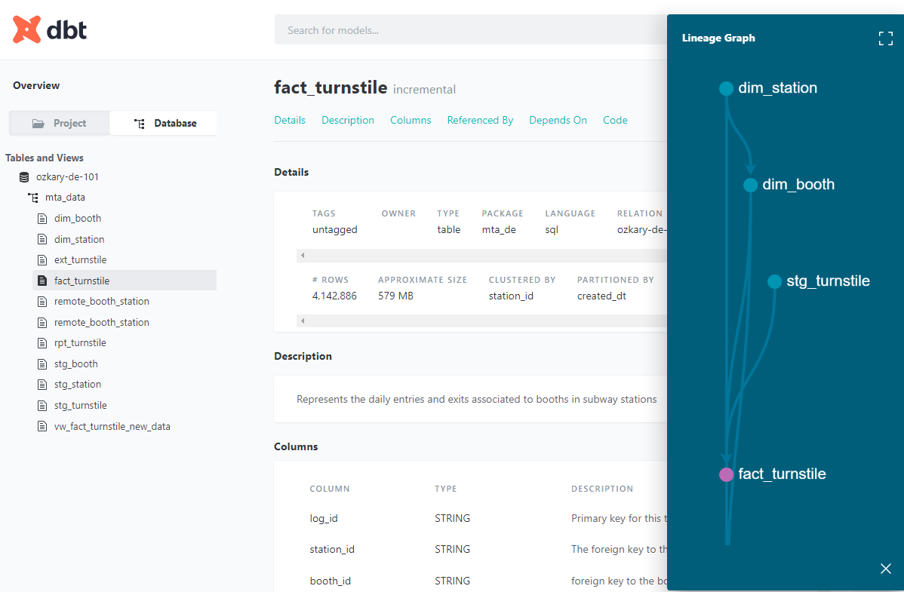

# Step 4 Data Warehouse and Data Modeling

After defining a data pipeline orchestration process, we need to define how to store the data, so it can become available to visualization and analysis tools. A Data Lake is a great location to store large amounts of data, but it is not designed to allow the reading of information. For that purpose, we need to use a Data Warehouse (DW), which is an Online Analytical Processing (OLAP) tool. 

> 👉 [Data Engineering Fundamental Series - Data Warehouse and Transformation](https://www.ozkary.com/2023/06/data-engineering-process-fundamentals-data-warehouse-transformation.html)     
> 👉 [Data Engineering Fundamental YouTube Video](https://www.youtube.com/live/14eRohtAE-w?si=8xLECzhfOhBgBB9K)    


In contrast to the ETL process employed by Data Lakes with Python code, a Data Warehouse (DW) relies on the ETL process. This fundamental distinction emphasizes the need for well-defined and optimized models within the DW, enabling efficient data access and exceptional performance.

Before proceeding with table construction, our initial focus is on creating precise data models based on thorough analysis and specific requirements. To achieve this, we aim to leverage a tool that facilitates model development in an automated, testable, and repeatable manner. By incorporating such tools into our project, our architecture evolves to the following:


## Data Modeling

We are using cloud data build tools (dbt) to build the data analysis resources on BigQuery. With this tool, we can define the lookup, facts and dimensions table in a way that enables us to support a CI/CD process by rebuilding the project resources and pushing the changes to the cloud hosting environment. Another great tool for data modeling between a data lake and data warehouse is Apache Spark.

> [Use cloud dbt for a SQL like approach](https://www.getdbt.com/)

> [Use Apache Spark when using Python or need data streaming](https://spark.apache.org/)

<a target="_dbt" href="https://github.com/ozkary/data-engineering-mta-turnstile/wiki/Configure-dbt-CLI">Read dbt CLI Configuration to use your terminal instead of dbt cloud</a>

> Jinja is a text-based template script 

To build our models, we should follow these specifications:

- Create an external table using the Data Lake folder and *.csv.gz file pattern as a source
  - ext_turnstile
- Create the staging models
  - Create the station view (stg_station) from the external table as source
    - Get the unique stations 
    - Create a surrogate key using the station name    
  - Create the booth view (stg_booth) from the external table as source
    - Get the unique booths and associate to the station id
    - Create a surrogate key using the booth unit and ca fields    
- Create the physical models
  - Create the station dimension table (dim_station) from the stg_station model    
  - Create the booth dimension table (dim_booth) from the stg_booth model    
    - Cluster the table by station_id  
  - Create the fact table (fact_turnstile) using the external table structure and an incremental strategy for ongoing new data    
    - Partition the table by created_dt and day granularity
    - Cluster the table by station_id
    - Join on dimension tables to use id references instead of text
  - Continuously run all the model with an incremental strategy to append new records

Our physical data model should look like this:


### Why do we use partitions and cluster

- Partitioning is the process of dividing a large table into smaller, more manageable parts based on the specified column . Each partition contains rows that share a common value like a specific date. A partition improves performance and query cost.

- When we run a query in BigQuery, it gets executed by a distributed computing infrastructure that spans multiple machines. Clustering is an optional feature in BigQuery that allows us to organize the data within each partition. The purpose of clustering is to physically arrange data within a partition in a way that is conducive to efficient query processing.

#### SQL Server and Big Query Concept Comparison

- In SQL Server, a clustered index defines the physical order of data in a table. In BigQuery, clustering refers to the organization of data within partitions based on one or more columns. Clustering in BigQuery does not impact the physical storage order like a clustered index in SQL Server.

- Both SQL Server and BigQuery support table partitioning. The purpose is similar, allowing for better data management and performance optimization. 

## How to Run It

**Note: For this execution plan, we are using dbt cloud and GitHub**

### Requirements

**Note: Make sure to run the prefect flows from step 2. That process copy files to the Data Lake.**

- CSV files in the Data Lake
- dbt account
  - Run the process from dbt cloud 
  - Link dbt with your Github project
  - Create schedule job on dbt cloud for every Sunday 9am
  - Or install locally (VM) and run from the CLI
- GitHub account
- Google BigQuery resource 

**Note: Use the dbt folder**

### Create the models

  In the models folder, we create the folder and files for the process. 
  
  - staging
    This folder contains the raw data in the form of specialized views to make the different data sources uniforms. These files are used by the core files to build the
    actual tables.

    - Create the schema.yml file which provides the database connection information as well as the schema definition for the models
    - Add the models with the view materialization strategies. 
       - A view for each data source with a common field names as this goes into the fact tables
       - A view for the station dimension from the seed/lookup table
       - A view for the booth dimension from the seed/lookup table

    - core   
     This folder hosts the resources that are made available for the data analysis process. This includes the materialized fact and dimension tables

     - Add the dimension station and booth tables from the view models
     - Add the fact table with all the views as source
         - Use common table expressions to be able to join all the views
     - Add a schema.yml file to describe all the tables


### Review the Code

Start by navigating to the dbt project folder.

```bash
$ cd Step4-Data-Warehouse/dbt
```

Project tree:

```
- dbt
  │
  ├─ models
  │   │
  │   ├─ core
  │   │   ├─ schema.yml
  │   │   ├─ dim_booth.sql
  │   │   ├─ dim_station.sql
  │   │   ├─ fact_turnstile.sql
  │   │   └─ ...
  │   ├─ staging
  │   │   ├─ schema_*.yml
  │   │   ├─ stg_booth.sql
  │   │   ├─ stg_station.sql
  │   │   ├─ stg_turnstile.sql
  │   │   └─ ...  
  │   ├─ target
  │   │   ├─ compile
  │   │   ├─ run
  │   │   └─ ...  
  └─ dbt_project.yml

```

The dbt folder contains the SQL-based source code. The staging folder contains the view definitions. The core folder contains the table definitions. The schema files in those folders have test rules and data constraints that are used to validate the models. This is how we are able to test our models. 

The schema.yml files are used as configurations to define the schema of the final output of the models. It provides the ability to explicitly specify the column names, data types, and other properties of the resulting table created by each dbt model. This file allows dbt to generate the appropriate SQL statements for creating or altering tables in the target data warehouse.

### Lineage 

Data lineage is the documentation and tracking of the flow of data from its origin to its destination, including all the intermediate processes and transformations that it undergoes. In this case, we show how the external table is the source for the fact table and the dimension table dependencies.


### dbt Commands on the dbt cloud command line (browser)

-  Clone this project
-  Install dbt and add the package dependencies in the packages.yml (root folder)   
-  Use dbt init to initialize the project profile to your resources
   - Set up a dbt profile to connect to your cloud-based data warehouse. This typically involves creating a new profile in your ~/.dbt/profiles.yml file, or editing an existing profile. You should refer to the documentation for your cloud platform to determine the appropriate parameters to include in your profile.

```bash
$ pip install dbt-core dbt-bigquery
$ dbt init
$ dbt deps 
```  
- The packages.yml file should have the following dependency
```bash
    packages:
    - package: dbt-labs/dbt_utils
        version: 0.8.0
 ```

- Test your connection by running a dbt command that requires a connection to your cloud-based data warehouse, such as dbt list.
- Once you have verified that your connection is working, you can use the --profile flag to specify which profile to use for each dbt command. For example, to run dbt using the Analytics profile, you would use the command:

> The profile name is defined in the dbt_project.yml file

```bash
dbt list --profile Analytics
```
- Connect to your Data Warehouse 
- Create an external table using the Data Lake files as the source with the following script

When this file is executed and the external table is created, the data warehouse retrieves the metadata about the external data, such as the schema, column names, and data types, without actually moving the data into the data warehouse storage. Once the external table is created, we can query the data using SQL as if it were a regular table. 

**Note: This is a BigQuery example**

```sql
CREATE OR REPLACE EXTERNAL TABLE mta_data.ext_turnstile
OPTIONS (
  format = 'CSV',
  uris = ['gs://ozkary_data_lake_ozkary-de-101/turnstile/*.csv.gz']  
);

```

- to create the seed tables/lookup with a CSV file

```bash
$ dbt seed 
```

- Builds the model and uses the variable to allow for the full dataset to be created

```bash
$ dbt build --select stg_booth.sql --var 'is_test_run: false'
$ dbt build --select stg_station.sql --var 'is_test_run: false'
$ dbt build --select stg_turnstile.sql --var 'is_test_run: false'

$ dbt build --select dim_booth.sql 
$ dbt build --select dim_station.sql 
$ dbt build --select fact_turnstile.sql

```  
- After running these command, the following resources should be in the data warehouse


> The build command is responsible for compiling, generating and deploying the SQL code for your dbt project, while the run command executes that SQL code against your data warehouse to update the data. Typically, you would run dbt build first to compile the project, and then run dbt run to execute the compiled code against the database.

- Validate the project. There should be no errors
```bash
$ dbt debug
```
- Run the test 
```bash
$ dbt test
```


- Generate documentation 
```bash
$ dbt docs generate
```



- To see the project folder configuration
```bash
$ dbt debug --config-dir
```

- Schedule the job
  - On dbt Cloud setup the dbt schedule job to run every Sunday at 9am
  - Use the production environment
  - Use the following command

```bash
$ dbt run --model fact_turnstile.sql
```

- After running the cloud job, the log should show the following


**Note: There should be files on the Data Lake for the job to insert any new records. To validate this, run these queries from the Data Warehouse**

```sql
-- check station dimension table
select count(*) from mta_data.dim_station;

-- check booth dimension table
select count(*) from mta_data.dim_booth;

-- check the fact table
select count(*) from mta_data.fact_turnstile;

-- check the staging fact data
select count(*) from mta_data.stg_turnstile;
```

- To check the weekly new data, we can use this query.

[Query for New Incremental (only) Fact Data](sql/fact_tunstile_incremental.sql)

### Data Policies

The files from the Data Lake have an expiration policy. Files older than two weeks will be drop from storage. This should allow for the process to keep a good performance.


> 👉 [Data Analysis and Visualization](https://github.com/ozkary/data-engineering-mta-turnstile/tree/main/Step5-Analysis)