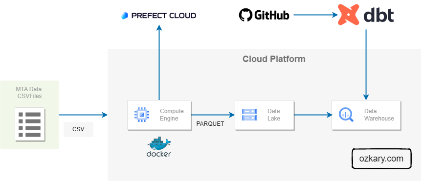
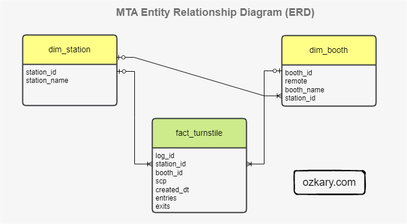

# Step 4 Data Warehouse and Data Modeling

After defining a data pipeline orchestration process, we need to define how to store the data, so it can become available to visualization and analysis tools. A Data Lake is a great location to store large amounts of data, but it is not designed to allow the reading of information. For that purpose, we need to use a Data Warehouse (DW), which is an Online Analytical Processing (OLAP) tool. 

Unlike the ELT process that is used by Data Lakes, a DW uses the ETL process. This basically mean that the DW should have well-defined and optimized models, so the information can be accessed with great performance. 

Before we start building tables, we need to first create our models based on our initial analysis and requirements. We would like to use a tool that enable us to build our models in a way that it can be automated, testable and repeatable. Once we add, this process into our project, our architecture should now look as follows:



## Data Modeling

We are using dbt (data build tools) to build the data analysis resources on BigQuery. With this tool, we can define the lookup, facts and dimensions table in a way that enables us to support a CICD process by rebuilding the project resources and pushing the changes to the cloud hosting environment.

- On the DW, create an external table using the Data Lake folder and parquet files as a source
- Use dbt as a model tool to create the optimized models
  - Create a seed table to be able to get the source for the lookup values
  - Create the dimension tables
    - dim_station
    - dim_booth
  - Create the fact table
    - Fact_turnstile
  - Partition the table by created_dt and day granularity
  - Cluster the table by station_id
  - Join on dimension tables to use references instead of text

Our data model should look like this:



## How to Run It

**Note: For this execution plan, we are using dbt cloud and GitHub**

### Requirements

- dbt account
  - Run the process from dbt cloud 
- GitHub account
- Googl BigQuery resource 

**Note: Use the dbt folder**

### Create the models

  In the models folder, we create the folder and files for the process. 
  
  - staging
    This folder contains the raw data in the form of specialized views to make the different data sources uniforms. These files are used by the core files to build the
    actual tables.

    - Create the schema.yml file which provides the database connection information as well as the schema definition for the models
    - Add the models with the view materialization strategies. 
       - A view for each data source with a common field names as this goes into the fact tables
       - A view for the station dimension from the seed/lookup table
       - A view for the booth dimension from the seed/lookup table

    - core   
     This folder hosts the resources that are made available for the data analysis process. This includes the materialized fact and dimension tables

     - Add the dimension station and booth tables from the view models
     - Add the fact table with all the views as source
         - Use common table expressions to be able to join all the views
     - Add a schema.yml file to describe all the tables

### dbt Commands on the dbt cloud command line (browser)

- Add the package dependencies in the packages.yml (root folder)   

```
$ dbt deps 
```  
  
```
    packages:
    - package: dbt-labs/dbt_utils
        version: 0.8.0
 ```

- to create the seed tables/lookup with a CSV file

```
$ dbt seed 
```

- Run the model
```
$ dbt run --m <model.sql>
```

- Test your data
```
$ dbt test
```

- This command runs the seed, run and test at the same time
```
$ dbt build --select <model.sql>
```

- Builds the model and uses variables to allow for the full dataset to be created

```
$ dbt build --select <model.sql> --var 'is_test_run: false'
```  

- Generate documentation 
```
$ dbt docs generate
```

- To see the project folder configuration
```
$ dbt debug --config-dir
```

