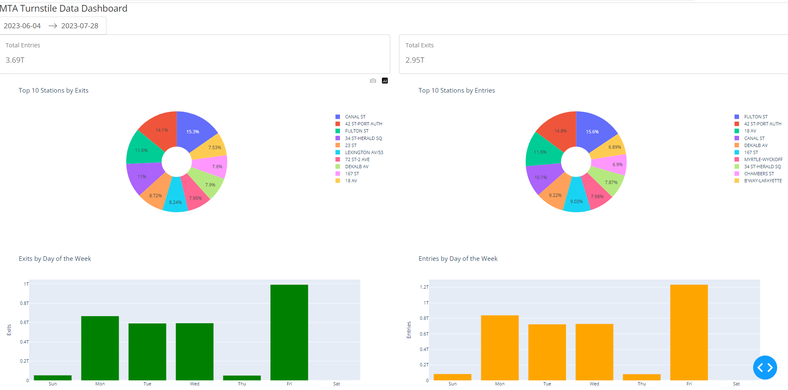
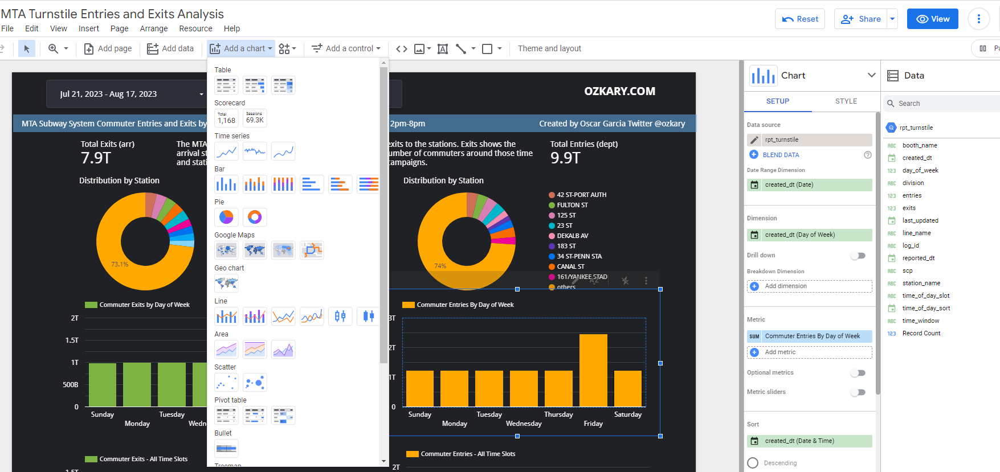
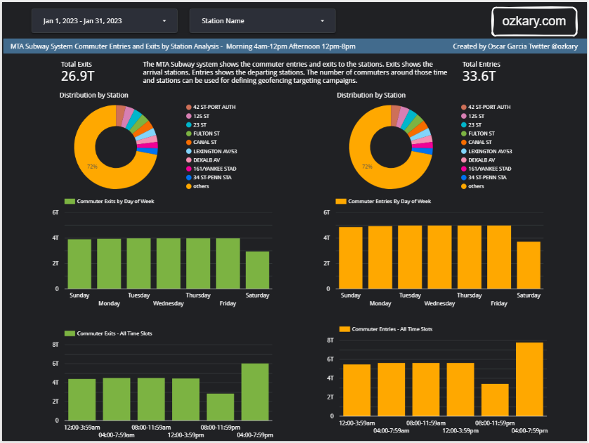
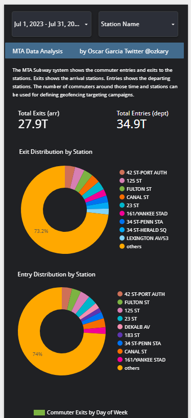

# Step 5 Data Analysis and Visualization
Data analysis and visualization are fundamental to a data-driven decision-making process. To grasp the best strategy for our scenario, we delve into the data analysis and visualization phase of the process, making data models, analyzes and diagrams that allow us to tell stories from the data.

Once the data is available from the Data Warehouse, the next step is to analyze and visualize the data, so we can understand the information that is providing. This is the moment where we look at the original requirements and determine what should be needed to meet them.

## Data Analysis Requirements

- Identify the time slots for morning and afternoon analysis
  - 12:00am-3:59am 
  - 04:00am-7:59am 
  - 08:00am-11:59am 
  - 12:00pm-3:59pm 
  - 04:00pm-7:59pm 
  - 08:00pm-11:59pm
	
- Examine data regarding commuter exits (arrivals) and entries (departures)
- Implement a master filter for date ranges, which exerts control over all charts
- Incorporate a secondary filter component to facilitate station selection
- Display the aggregate counts of entries and exits for the designated date range
  - Employ score card components for this purpose
- Investigate station distributions to identify the most frequented stations
  - Utilize donut charts, with the subway station name as the primary dimension
- Analyze distributions using the day of the week to unveil peak traffic days
  - Employ bar charts to visualize entries and exits per day
- Explore distributions based on time slots to uncover daily peak hours
  - Integrate bar charts to illustrate entries and exits within each time slot

## Data Analysis

Data analysis is the practice of exploring data and understanding its meaning. It involves activities that can help us achieve a specific goal, such as identifying data dimensions and measures, as well as data analysis to identify outliers, trends, distributions, and hypothesis testing.

> Use the Jupyter Notebook file analysis.ipynb

```python

import pandas as pd

# use the sample dataset in this path Step5-Analysis/analysis_data.csv
df = pd.read_csv('./analysis_data.csv', iterator=False)
df.head(10)

# Define time (hr) slots
time_slots = {
    'morning': (8, 11),
    'afternoon': (12, 15),
    'night': (16, 20)
}
# cast the date column to datetime
df["created_dt"] = pd.to_datetime(df['created_dt'])
df["exits"] = df["exits"].astype(int)
df["entries"] = df["entries"].astype(int)

# Calculate average arrivals (exits) and departures (entries) for each time slot
for slot, (start_hour, end_hour) in time_slots.items():
    slot_data = df[(df['created_dt'].dt.hour >= start_hour) & (df['created_dt'].dt.hour < end_hour)]
    avg_arrivals = slot_data['exits'].mean()
    avg_departures = slot_data['entries'].mean()
    print(f"{slot.capitalize()} - Avg Arrivals: {avg_arrivals:.2f}, Avg Departures: {avg_departures:.2f}")

# output
Morning - Avg Arrivals: 30132528.64, Avg Departures: 37834954.08
Afternoon - Avg Arrivals: 30094161.08, Avg Departures: 37482421.78
Night - Avg Arrivals: 29513309.25, Avg Departures: 36829260.66
```

The code calculates the average arrivals and departures for each time slot. It prints out the results for each time slot, helping us identify the patterns of commuter activity during different times of the day.

## Data Visualization

Data visualization is a powerful tool that takes the insights derived from data analysis and presents them in a visual format. While tables with numbers on a report provide raw information, visualizations allow us to grasp complex relationships and trends at a glance. Dashboards, in particular, bring together various visual components like charts, graphs, and scorecards into a unified interface.

## Code-Centric - Python Dashboard 

These are the requirements to be able to run the Python dashboard:

- Use the analysis_data.csv file
  - Use the local file for this implementation
- Install the Python dependencies 
  - Type the following from the terminal

```bash
$ pip install pandas
$ pip install plotly
$ pip install dash
$ pip install dash_bootstrap_components
```

### Review the Code

The `update_dashboard` function is responsible for updating and refreshing the dashboard. It handles the data range change event. As the user changes the date range, this function takes in the start and end dates as inputs. The function then filters the dataset, retaining only the records falling within the specified date range. Subsequently, the function calculates key metrics for the dashboard's score cards. It computes the total number of entries and exits during the filtered time period, and these values are converted to trillions for better readability.

The code proceeds to generate various visual components for the dashboard. These components include donut charts illustrating station-wise entries and exits, bar charts showcasing entries and exits by day of the week, and another set of bar charts displaying entries and exits by time slot. Each of these visualizations is created using specialized functions like create_station_donut_chart, create_day_bar_chart, and create_time_bar_chart.

```python

def update_dashboard(start_date, end_date):
    filtered_data = data[(data['created_dt'] >= start_date) & (data['created_dt'] <= end_date)]   
        
    total_entries = filtered_data['entries'].sum() / 1e12  # Convert to trillions
    total_exits = filtered_data['exits'].sum() / 1e12  # Convert to trillions
      
    measures = ['exits','entries']    
    filtered_data["created_dt"] = pd.to_datetime(filtered_data['created_dt'])  
    measures = ['exits','entries']  
    
    exits_chart , entries_chart = create_station_donut_chart(filtered_data)
    exits_chart_by_day ,entries_chart_by_day = create_day_bar_chart(filtered_data, measures)
    exits_chart_by_time, entries_chart_by_time = create_time_bar_chart(filtered_data, measures)
    
    return (
        f"{total_entries:.2f}T",
        f"{total_exits:.2f}T",
        entries_chart,
        exits_chart,
        exits_chart_by_day,
        entries_chart_by_day,
        exits_chart_by_time,
        entries_chart_by_time
    )
```

### How to Run It

After installing the dependencies and downloading the code, we should be able to run the code from terminal by typing:

```bash
$ python3 dashboard.py
```

Once the implementation of this Python dashboard is complete, we can run it and see the following dashboard load on our browser:



## Low-Code - Data Analysis Tools

For this analysis and visualization process, we are using lookerstudio.google.com.  Looker is Business Intelligence (BI) tools, which enables users to create dashboards on the data that is being analyzed. It is a no-code tool that can load data models from disparate data sources. 

> [Sign-up for Looker Studio](https://lookerstudio.google.com/)

Other Visualizations tools: 

> [PowerBI](https://powerbi.microsoft.com/)

> [Tableau](https://www.tableau.com/)

### Dashboard Specifications

- Sign up for a looker account or use another BI tool
- Create a new dashboard
- Click on the Add Data button
- Use the connector for our data source
   -  This should enable us to configure the credentials for the access
   -  Pick the view rpt_turnstile which already has the join with the fact_table and the dimension tables
- Once the data is loaded, we can see the dimensions and measures
- Add the dashboard filters
  - Add a date range control for the filter, this should use the created_dt field
  - Add a list control and associate it with the station name
- Add the rest of the charts
- All charts should be associated with the date range dimension
  - This enables the filtering to cascade to all the charts
- Use the entries and exits measures for all the dashboards
  - Add two scorecards for the sum of entries and exits 
  - Add a donut char for the exits and entries distribution by stations
  - Add two bar charts (entries and exits) and use the week day value from the created date dimension
    - Sort then by the week day. Use the day number (0-6) not name (Sun-Sat). This is done by adding a new field with this code and using that for sorting

```python
WEEKDAY(created_dt)
```
  - Create the time slot dimension field (click add field and enter this definition)
```python
CASE 
    WHEN HOUR(created_dt) BETWEEN 0 AND 3 THEN "12:00-3:59am" 
    WHEN HOUR(created_dt) BETWEEN 4 AND 7 THEN "04:00-7:59am" 
    WHEN HOUR(created_dt) BETWEEN 8 AND 11 THEN "08:00-11:59am" 
    WHEN HOUR(created_dt) BETWEEN 12 AND 15 THEN "12:00-3:59pm" 
    WHEN HOUR(created_dt) BETWEEN 16 AND 19 THEN "04:00-7:59pm" 
    WHEN HOUR(created_dt) BETWEEN 20 AND 23 THEN "08:00-11:59pm" 
END
```

  - Add two bar charts (entries and exits) and use the time slot dimension
    - Use the hour value from the created date dimension for sorting by adding a new field and using that for your sort criteria

```python
HOUR(created_dt)
```

### Looker UI

Take a look at the image below. This is the Looker UI. We should familiarize ourselves with the following areas:



- Add data: Use this to add a new data source
- Add a chart: This allows us to add new charts
- Add a control: Here, we can add the date range and station name list
- Canvas: This is where we place all the components
- Setup Pane: This allows us to configure the date range, dimension, measures, and sorting settings
- Style Pane: Here, we can configure the colors and font
- Data Pane: This displays the data sources with their fields. New fields are created as functions. When we hover over a field, we can see a function (fx) icon, which indicates that we can edit the function and configure our snippet


### View the Dashboard

After following all the specification, we should be able to preview the dashboard on the browser. We can load an example, of a dashboard by clicking on the link below:

> 👉 [View the dashboard online](https://lookerstudio.google.com/reporting/94749e6b-2a1f-4b41-aff6-35c6c33f401e/)

> 👉 [View the mobile dashboard online](https://lookerstudio.google.com/s/qv_IQAC-gKU)



This is a an image of the mobile dashboard.




## Data Analysis Conclusions

By looking at the dashboard, the following conclusions can be observed:

- The stations with the highest distribution represent the busiest location 
- The busiest time slot for both exits and entries is the hours between 4pm to 9pm
- All days of the week show a high volume of commuters
- Businesses can select the station close to their location for further analysis
  

With these observations, plans can be made to optimize the marketing campaigns and target users around a geo-fence area and hours of the day with proximity to the corresponding business locations.  

## Summary

We utilize our expertise in data analysis and visualization to construct charts and build them into dashboards. We adopt two distinct approaches for dashboard creation: a code-centric method and a low-code enterprise solution like Looker. After a comprehensive comparison, we deduce that the code-centric approach is optimal for small teams, whereas it might not suffice for enterprise users, especially when targeting executive stakeholders.

Lastly, as the dashboard becomes operational, we transition into the role of business analysts, deciphering insights from the data. This enables us to offer answers aligned with our original requirements.
