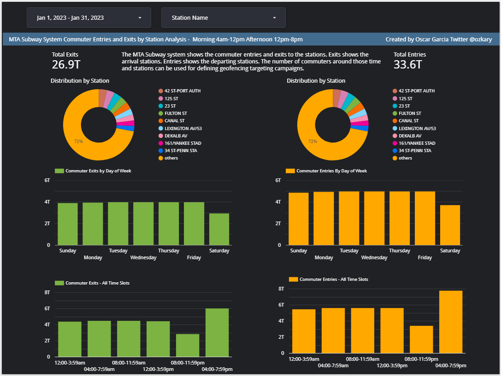

# Step 5 Data Analysis and Visualization

Once the data is available from the Data Warehouse, the next step is to analyze and visualize the data, so we can understand the information that is providing. This is the moment where we look at the original requirements and determine what should be needed to meet them

## Data Analysis Requirements

- Identify the time slots for morning and afternoon analysis
  - 12:00am-3:59am 
  - 04:00am-7:59am 
  - 08:00am-11:59am 
  - 12:00pm-3:59pm 
  - 04:00pm-7:59pm 
  - 08:00pm-11:59pm
	
- Analyze the data by commuter exits (arrival) and entries (departure)
- Filter the data by date 
- Show the total number of entries and exits
- Use scorecards charts
  - Look at the distribution by stations, which represents the busiest stations
- Create donut charts using the subway station name as main dimension 
  - Pivot the information using the day of the week to identify the busiest days
- Add a bar chart to see the exits and entries per day
 - Pivot the data using the time slot to identify the busiest hours of the day
- Add a bar chart to see the exits and entries within each time slot

## Data Analysis Tools

For this analysis and visualization process, we are using lookerstudio.google.com.  Looker is Business Intelligence (BI) tools, which enables users to create dashboards on the data that is being analyzed. It is a no-code tool that can load data models from disparate data sources. 

[Signup for Looker Studio](https://lookerstudio.google.com/)

**Note: Other tools like PowerBI, Tableau can also be used to do the analysis**

## Data Analysis Conclusions

By looking at the dashboard, the following conclusions can be observed:

The stations with the highest distribution represent the busiest location 
The busiest time slot for both exits and entries is the hours between 4pm to 9pm
All days of the week show a high volume of commuters

With these observations, plans can be made to optimize the marketing campaigns and target users around a geo-fence area and hours of the day with proximity to the corresponding business locations.  

## View the Dashboard

Load the dashboard by clicking this link:

https://lookerstudio.google.com/reporting/94749e6b-2a1f-4b41-aff6-35c6c33f401e





## Dashboard Specifications

- Sign up for a looker account or use another BI tool
- Create a new dashboard
- Click on the Add Data button
- Connect to the data source
- Once the data is loaded, we can see the dimensions and measures
- Use the entries and exits measures for all the dashboards
- Add two scorecards for the sum of entries and exits 
- Add a donut char for the exits and entries by stations
- Add two bar charts (entries and exits) and use the week day value from the created date dimension
- Sort then by the week day. Use the day number not name (0-6) (Sun-Sat)

```
WEEKDAY(created_dt)
```

- Create the time slot dimension field (click add field and enter this definition)
```
CASE 
    WHEN HOUR(created_dt) BETWEEN 0 AND 3 THEN "12:00-3:59am" 
    WHEN HOUR(created_dt) BETWEEN 4 AND 7 THEN "04:00-7:59am" 
    WHEN HOUR(created_dt) BETWEEN 8 AND 11 THEN "08:00-11:59am" 
    WHEN HOUR(created_dt) BETWEEN 12 AND 15 THEN "12:00-3:59pm" 
    WHEN HOUR(created_dt) BETWEEN 16 AND 20 THEN "04:00-7:59pm" 
    WHEN HOUR(created_dt) BETWEEN 20 AND 23 THEN "08:00-11:59pm" 
END
```
- Add two bar charts (entries and exits) and use the time slot dimension
- Use the hour value from the created date dimension for sorting
```
HOUR(created_dt)
```
