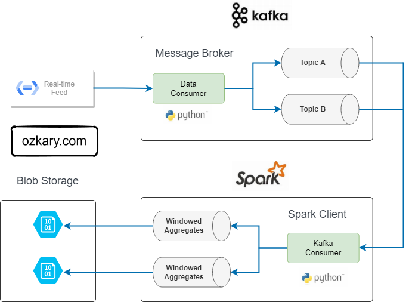
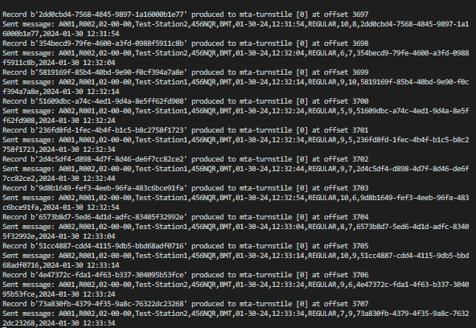
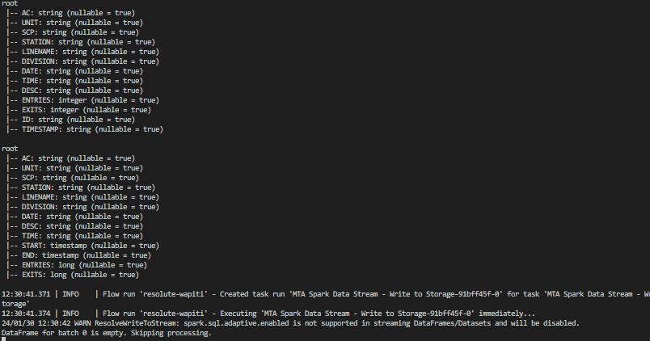
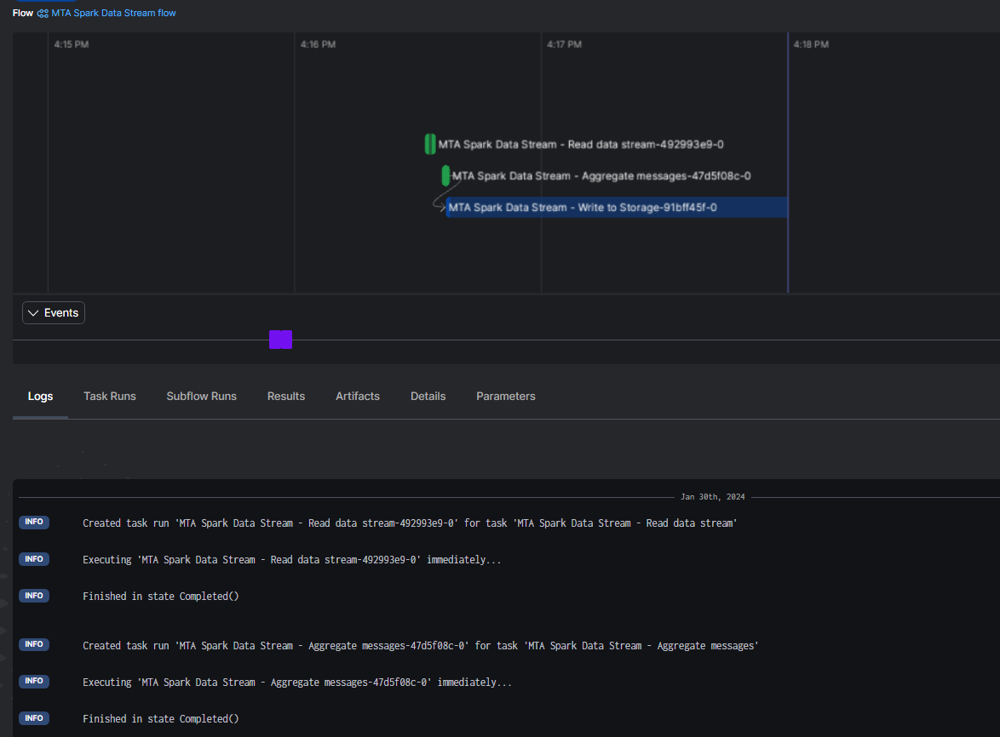
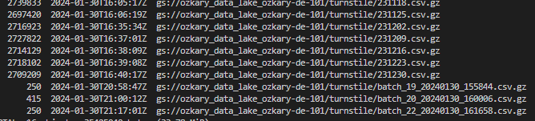
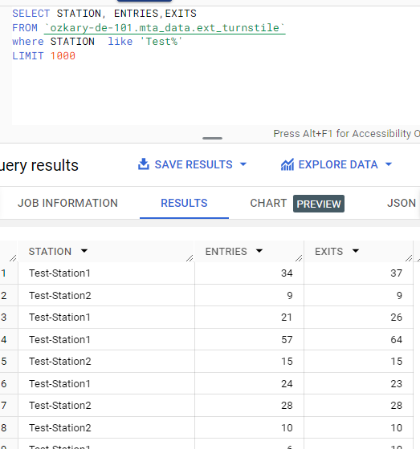

# Data Streaming with Kafka and Spark

Now that we've covered the concepts of data streaming, let's move forward with an actual coding exercise. During this exercise, we'll delve into building a Kafka message broker and a Spark consumer with the objective of having the Kafka message broker work as a data producer for our subway system information. 

## Kafka Producer

- [Kafka with CSharp](./kafka/csharp/)
- [Kafka with Python](./kafka/python/)


## Data Streaming Data Flow Process

To deliver a data streaming solution, we typically employ a technical design illustrated as follows:



- **Kafka**
  - Producer
  - Topics
  - Consumer

- **Spark**
  - Kafka Consumer
  - Message Parsing and Aggregations
  - Write to Data Lake or Other Storage


### Requirements

- Docker and Docker Hub
    - [Install Docker](https://github.com/ozkary/data-engineering-mta-turnstile/wiki/Configure-Docker)
    - [Create a Docker Hub Account](https://hub.docker.com/)
- Prefect dependencies and cloud account
  - Install the Prefect Python library dependencies
  - [Create a Prefect Cloud account](https://www.prefect.io/)
- Data Lake for storage
  - Make sure to have the storage account and access ready

> 👉 Before proceeding with the setup, ensure that the storage and Prefect credentials have been configured as shown on the [Orchestration exercise](https://github.com/ozkary/data-engineering-mta-turnstile/tree/main/Step3-Orchestration) step.

#### Docker Compose file

Utilize the **docker-bitnami.compose.yaml** file to configure a unified environment where both of these services should run. In the event that we need to run these services on distinct virtual machines (VMs), we would deploy each Docker image on a separate VM.

#### Download the Docker Images

Before we proceed to run the Docker images, it's essential to download them in the target environment. To download the Bitnami images, you can execute the following script from a Bash command line:

```bash
$ bash download_images.sh
```

#### Start the Services

Once the Docker images are downloaded, initiate the services by executing the following script:

```bash
bash start_services.sh
```

## Review the Code

To enable this functionality, we need to develop a Kafka producer and a Spark Kafka consumer, both implemented in Python. Let's begin by examining the fundamental features of the producer:

### Kafka Producer

The Kafka producer is a Python application designed to generate messages every 10 seconds. The `produce_messages` function utilizes messages from the provider and sends the serialized data to a Kafka topic.

### Spark - Kafka Consumer

The Spark PySpark application listens to a Kafka topic to retrieve messages. It parses these messages using a predefined schema to define the fields and their types. Since these messages arrive every ten seconds, our goal is to aggregate them within a time-span duration of five minutes. 

## How to runt it!

With all the requirements completed and the code review done, we are ready to run our solution. Let's follow these steps to ensure our apps run properly.

### Start the Container Services

Initiate the container services from the command line by executing the following script:

```bash
$ bash start_services.sh
```

### Install dependencies and run the apps

> 👉 These applications depend on the Kafka and Spark services to be running. Ensure to start those services first.

#### Kafka Producer 

Execute the producer with the following command line:

```bash
$ bash start_producer.sh
```

#### Spark - Kafka Consumer

Execute the Spark consumer from the command line:

```bash
$ bash start_consumer.sh
```

### Execution Results

After the producer and consumer are running, the following results should be observed:

### Kafka Producer Log



As messages are sent by the producer, we should observe the activity in the console or log file.


### Spark Consumer Log



Spark parses the messages in real-time, displaying the message schemas for both the individual message from Kafka and the aggregated message. Once the time window is complete, it serializes the message from memory into a compressed CSV file.

### Cloud Monitor



As the application runs, the flows and tasks are tracked on our cloud console. This tracking is utilized to monitor for any failures.

### Data Lake Integration



Upon serializing the data aggregation, a compressed CSV file is uploaded to the data lake with the purpose of making it visible to our data warehouse integration process.

### Data Warehouse Integration



Once the data has been transferred to the data lake, we can initiate the integration from the data warehouse. A quick way to check is to query the external table using the test station name.

> 👉 Our weekly batch process is scheduled once per week. However, in a data stream use case, where the data arrives more frequently, we need to update the schedule to an hourly or minute window.

